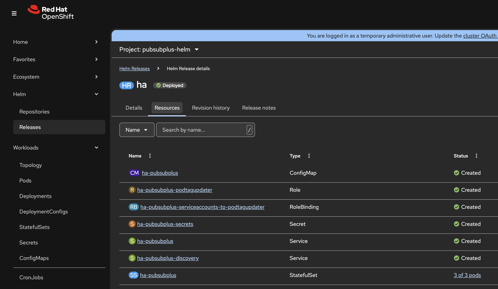

= Deploy Solace PubSub+ with Helm chart

https://helm.sh/[Helm] is a simple tool to deploy applications on Kubernetes. Deployed Helm release and their resources can also be seen in the OpenShift UI.

*Solace PubSub+ Helm chart*: https://github.com/SolaceProducts/pubsubplus-kubernetes-helm-quickstart/

== Values file

Here is a values file for small HA deployment:

[source,yaml]
----
solace:
  redundancy: true

  usernameAdminPassword: secret

  systemScaling:
    maxConnections: 100
    maxQueueMessages: 100
    maxSpoolUsage: 150
    cpu: 1
    memory: 2500Mi

securityContext:
  enabled: false

serviceAccount:
  create: false

tls:
  enabled: true
  serverCertificatesSecret: 'tls-openshift'

service:
  # service.type specifies how to expose the service: options include ClusterIP, NodePort, LoadBalancer (default if not specified)
  type: ClusterIP

storage:
  persistent: true
  size: 10Gi
  monitorStorageSize: 1Gi
----

To access non-http - messaging - endpoints through an OpenShift route we need to enable TLS, see details https://medium.com/itnext/how-to-access-your-app-behind-an-openshift-router-87cbae3e7185[here]. Alternatively you can use LoadBalancer (in cloud) or NodePort (on-prem) services. 
So first you need to create the `tls-openshift` secret in the namespace that has the key/certificate.


== Deploy chart

The OpenShift - passthrough - routes are not created by the Helm chart, but they can easily be created with the `oc` CLI.

Here are example commands to deploy the Helm chart from git source:

[source,sh]
----
# Create namesapce
oc new-project pubsubplus-helm

# TLS
oc create secret tls tls-openshift --cert=tls.crt --key=tls.key

# Use path of git https://github.com/SolaceProducts/pubsubplus-kubernetes-helm-quickstart/ 
helm upgrade -i ha ~/git/pubsubplus-kubernetes-helm-quickstart/pubsubplus -f values-ha.yaml

# Create routes
oc create route passthrough semp    --service=ha-pubsubplus --port=tls-semp
oc create route passthrough amqp    --service=ha-pubsubplus --port=tls-amqp
oc create route passthrough smf     --service=ha-pubsubplus --port=tls-smf
oc create route passthrough smfweb  --service=ha-pubsubplus --port=tls-web
oc create route passthrough mqtt    --service=ha-pubsubplus --port=tls-mqtt
oc create route passthrough mqttweb --service=ha-pubsubplus --port=tls-mqttweb
----

Get the admin route hostname and open in the browser:

```
oc get route semp 
```

Open https://semp-pubsubplus-helm.apps.your_cluster_domain.com and login with `admin` and the password set in the values file. Make sure you create a queue and a user before trying to send messages.

== Send/receive messages

Different protocols can be used via different routes (hostnames), but all on port 443:

[cols="1,4"]
|===
| SMF 
| `tcps://smf-pubsubplus-helm.apps.your_cluster_domain.com:443`
| SMF over websocket
| `wss://smfweb-pubsubplus-helm.apps.your_cluster_domain.com:443`
| AMQP
| `amqps://amqp-pubsubplus-helm.apps.your_cluster_domain.com:443`
| MQTT
| `ssl://mqtt-pubsubplus-helm.apps.your_cluster_domain.com:443`
| MQTT over websocket
| `wss://mqttweb-pubsubplus-helm.apps.your_cluster_domain.com:443`
|===

== Deployment overview

The Helm chart is easy to understand and it creates a couple of resources:



The main component is a _StatefulSet_ with 3 pods - and a headless service:

* `ha-pubsubplus-0` is the *primary* broker and the `ha-pubsubplus` _Service_ points to this `active` pod
* `ha-pubsubplus-1` is a replica *backup* instance that takes over in case of the primary broker goes down
* `ha-pubsubplus-2` is a *monitoring* instance. Its purpose is to detect failures and avoid split-brain scenarios.

It's worth looking at the created _ConfigMap_ that has and init/startup script, and also an interesting readiness check: 

* The `readiness_check.sh` is involved in the primary-backup failover mechanism. In case of issues it sets the Pod's label to `active=false`
* There is custom _Role_ that permits label changes for the _ServiceAccount_ running the Pod

== Additional notes

* A random admin password is generated the first time if it's net set in `values.yaml`. After changing the admin password in the created _Secret_ we also have to update it manually in each Pod using the `cli`, see details https://docs.solace.com/Admin/Configuring-Internal-CLI-User-Accounts.htm[here].
* The Helm chart is currently missing a feature to use an existing secret for admin password, which is a common use case in environments using a vault.
* Deleting the Helm chart will keep the PVCs in the namespace - which is a safe choice to avoid unexpected data loss - but you should remember to delete those manually for a fresh deployment in the same namespace.
* To resize the storage, we need to edit the created _PersistentVolumeClaims_ directly

