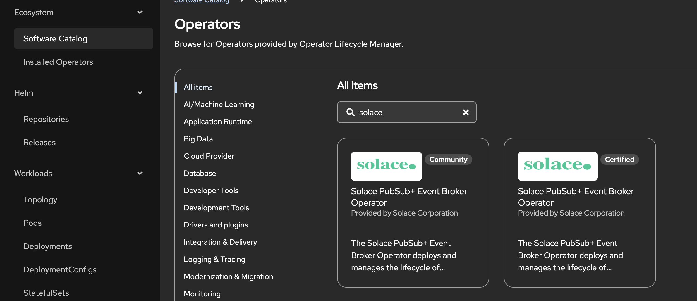
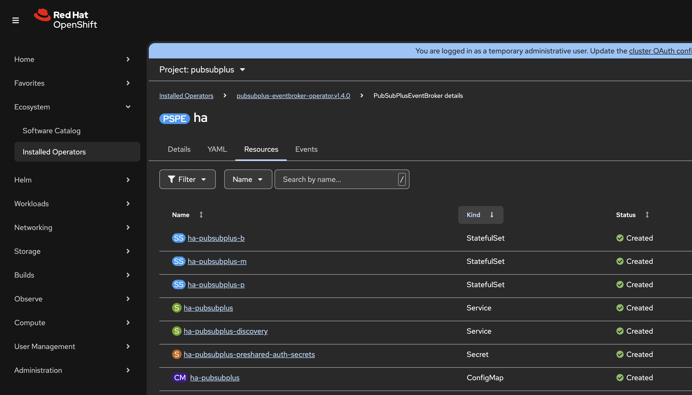

= Solace PubSub+ Event Broker Operator

https://kubernetes.io/docs/concepts/extend-kubernetes/operator/[Kubernetes Operators] were designed to deploy complex - typically stateful - applications and manage their configuration a cloud-native way on K8s. 

The *Solace PubSub+ Event Broker Operator* is _Certified_ for OpenShift and it's part of its default Software Catalog, which makes it the most convenient way to run the broker on a cluster.

== Documentation and links

* GitHub repo with guide and source: https://github.com/SolaceProducts/pubsubplus-kubernetes-quickstart
** Parameter reference: https://github.com/SolaceProducts/pubsubplus-kubernetes-quickstart/blob/main/docs/EventBrokerOperatorParametersReference.md
* OpenShift specific deployment:  https://github.com/SolaceProducts/pubsubplus-openshift-quickstart

== Install operator

The operator can be installed using the OpenShift Console - as a cluster admin - from _Ecosystem/Software Catalog_:



Alternatively you can create s _Subscription_ resource:

[source,yaml]
----
apiVersion: operators.coreos.com/v1alpha1
kind: Subscription
metadata:
  name: pubsubplus-eventbroker-operator
  namespace: openshift-operators
spec:
  channel: stable
  installPlanApproval: Automatic
  name: pubsubplus-eventbroker-operator
  source: certified-operators
  sourceNamespace: openshift-marketplace
  startingCSV: pubsubplus-eventbroker-operator.v1.4.0
----

[NOTE]
Don't use _Automatic_ update approval in production to avoid unexpected operator upgrades and potential issues related.

After installing the operator you'll have a new _PubSubPlusEventBroker_ CRD in the cluster that can be used to create PubSub+ Event Broker deployment.

== Deploy

Here is an example _PubSubPlusEventBroker_ resource for an HA deployment:

[source,yaml]
----
apiVersion: pubsubplus.solace.com/v1beta1
kind: PubSubPlusEventBroker
metadata:
  name: ha
spec:
  redundancy: true
  systemScaling:
    maxConnections: 100
    maxQueueMessages: 100
    maxSpoolUsage: 100
    messagingNodeCpu: "1"
    messagingNodeMemory: "2500Mi"
  storage:
    messagingNodeStorageSize: 10Gi
    monitorNodeStorageSize: 1Gi
  service:
    type: ClusterIP
  tls:
    enabled: true
    serverTlsConfigSecret: tls-cert
  adminCredentialsSecret: passwords
  monitoringCredentialsSecret: passwords
----

Before creating this resource, we should prepare a few other resources in the namespace:

* A _Secret_ with the admin and monitor user password, like this (or from a vault using _ExternalSecret_):
+
[source,yaml]
----
kind: Secret
apiVersion: v1
metadata:
  name: passwords
stringData:
  username_admin_password: admin
  username_monitor_password: monitor
----
* A _Secret_ with key/cert for TLS. This is required to access non-http - messaging - endpoints through an OpenShift route, see https://medium.com/itnext/how-to-access-your-app-behind-an-openshift-router-87cbae3e7185[details explained here]. Alternatively you can use a _LoadBalancer_ (in cloud) or _NodePort_ service type.

Here are some example commands to create a deployment with the operator:
[source,sh]
----
# Install operator from catalog
oc apply -f subscription.yaml

# Create namespace
oc new-project pubsubplus

# TLS Secret
oc create secret tls tls-cert --cert=tls.crt --key=tls.key

# Password for admin and monitor user
oc apply -f secret-passwords.yaml

# Create CR for the operator
oc apply -f pubsub-ha.yaml

# Create routes
oc create route passthrough semp    --service=ha-pubsubplus --port=tls-semp
oc create route passthrough amqp    --service=ha-pubsubplus --port=tls-amqp
oc create route passthrough smf     --service=ha-pubsubplus --port=tls-smf
oc create route passthrough smfweb  --service=ha-pubsubplus --port=tls-web
oc create route passthrough mqtt    --service=ha-pubsubplus --port=tls-mqtt
oc create route passthrough mqttweb --service=ha-pubsubplus --port=tls-mqttweb
----

Get the admin route hostname and open in the browser:

```
oc get route semp 
```

Open https://semp-pubsubplus.apps.your_cluster_domain.com and login with `admin` and the password set in the secret. 

== Messaging endpoints

Endpoints within Openshift cluster:


[cols="1,3"]
|===
| SMF 
| `tcp://ha-pubsubplus.pubsubplus.svc:55555`
| SMF TLS
| `tcps://ha-pubsubplus.pubsubplus.svc:55443`
| SMF over websocket
| `ws://ha-pubsubplus.pubsubplus.svc:8008`
| SMF over TLS websocket
| `wss://ha-pubsubplus.pubsubplus.svc:1443`
| AMQP
| `amqp://ha-pubsubplus.pubsubplus.svc:5672`
| AMQP TLS
| `amqps://ha-pubsubplus.pubsubplus.svc:5671`
| MQTT
| `tcp://ha-pubsubplus.pubsubplus.svc:1883`
| MQTT TLS
| `ssl://ha-pubsubplus.pubsubplus.svc:8883`
| MQTT over websocket
| `ws://ha-pubsubplus.pubsubplus.svc:8000`
| MQTT over TLS websocket
| `wss://ha-pubsubplus.pubsubplus.svc:8443`
|===

Clients outside the cluster can connect via different TLS protocols through different routes (hostnames), but all on port 443:

[cols="1,3"]
|===
| SMF 
| `tcps://smf-pubsubplus-helm.apps.your_cluster_domain.com:443`
| SMF over websocket
| `wss://smfweb-pubsubplus-helm.apps.your_cluster_domain.com:443`
| AMQP
| `amqps://amqp-pubsubplus-helm.apps.your_cluster_domain.com:443`
| MQTT
| `ssl://mqtt-pubsubplus-helm.apps.your_cluster_domain.com:443`
| MQTT over websocket
| `wss://mqttweb-pubsubplus-helm.apps.your_cluster_domain.com:443`
|===

Make sure you create a queue before trying to send messages. By default authentication is not enforced on messaging endpoints.

== Deployment overview

The Operator creates several resources:



The main components are three _StatefulSets_ with one pod per each:

* `ha-pubsubplus-p` is the *primary* broker and the `ha-pubsubplus` _Service_ points to this `active` pod
* `ha-pubsubplus-b` is a replica *backup* instance that takes over in case of the primary broker goes down
* `ha-pubsubplus-m` is a *monitoring* instance. Its purpose is to detect failures and avoid split-brain scenarios.

A headless _Service_ and a pre-shared auth key is created for internal communication between the nodes.

It's worth looking at the created _ConfigMap_ that has and init/startup script, and also an interesting readiness check: 

* The `readiness_check.sh` is involved in the primary-backup failover mechanism. In case of issues it sets the Pod's label to `active=false`
** There is a custom _Role_ `ha-pubsubplus-podtagupdater` that permits changing labels for the _ServiceAccount_ `ha-pubsubplus-sa` running the Pod

== Additional notes
* HA deployment or minimal developer mode
* Common operator based deployment features: 
** Pod image, resources (primary, backup), annotations, labels, env vars, security context, placement
** Service type, ports
** Storage class, initial size
*** For storage resize edit the _PersistentVolumeClaims_ directly
*** _PersistentVolumeClaims_ are retained for optional reuse, can be removed directly if required
** Overall patching of created resources is not supported
* Supports Prometheus monitoring
* Broker configuration is not managed by the operator
** Only initial admin/monitoring password, scaling parameters are supported
*** After changing passwords in the related _Secret_ we also have to update it manually in each Pod using the `cli`, see details https://docs.solace.com/Admin/Configuring-Internal-CLI-User-Accounts.htm[here].
* Supports TLS certificate rotation
* It's possible to migrate from a Helm based installation by reusing the _PersistentVolumes_
